# Terraform Backend Quick Start

## 🚀 Setup in 3 Steps

### Step 1: Create Azure Storage Backend

```bash
# Make script executable
chmod +x setup-terraform-backend.sh

# Run setup
./setup-terraform-backend.sh
```

**Output will show:**
```
✅ Terraform backend setup complete!

Add these values to your GitHub Secrets:
  TERRAFORM_BACKEND_RESOURCE_GROUP: terraform-state-rg
  TERRAFORM_BACKEND_STORAGE_ACCOUNT: tfstate1a2b3c4d
  TERRAFORM_BACKEND_CONTAINER: tfstate
  TERRAFORM_BACKEND_KEY: terraform.tfstate
```

### Step 2: Add GitHub Secrets

Go to: **GitHub Repository** → **Settings** → **Secrets** → **Actions**

Add these 4 secrets:

| Secret Name | Value from Script Output |
|-------------|--------------------------|
| `TERRAFORM_BACKEND_RESOURCE_GROUP` | `terraform-state-rg` |
| `TERRAFORM_BACKEND_STORAGE_ACCOUNT` | `tfstate1a2b3c4d` |
| `TERRAFORM_BACKEND_CONTAINER` | `tfstate` |
| `TERRAFORM_BACKEND_KEY` | `terraform.tfstate` |

### Step 3: Push to GitHub

```bash
git add .
git commit -m "Configure Terraform backend and update workflow"
git push origin main
```

## ✅ What's Changed

### 1. Workflow Order
```
Old: Validate → Deploy
New: Validate → Terraform → Deploy
```

### 2. Terraform Job
- Runs infrastructure deployment first
- Outputs app service name and URL
- Blocks deployment if infrastructure fails

### 3. Deploy Job
- Uses Terraform outputs (no more AZURE_APP_NAME secret needed)
- Only runs after Terraform succeeds
- Automatically gets correct app name

### 4. Backend Configuration
- State stored in Azure Storage
- State locking enabled
- Team collaboration ready

## 📋 Required GitHub Secrets

### Existing Secrets (keep these):
- ✅ `AZURE_CREDENTIALS` - Service principal JSON

### New Secrets (add these):
- ⭐ `TERRAFORM_BACKEND_RESOURCE_GROUP`
- ⭐ `TERRAFORM_BACKEND_STORAGE_ACCOUNT`
- ⭐ `TERRAFORM_BACKEND_CONTAINER`
- ⭐ `TERRAFORM_BACKEND_KEY`

### Optional (can remove):
- ❌ `AZURE_APP_NAME` - No longer needed (Terraform provides this)

## 🔄 Workflow Flow

```mermaid
graph TD
    A[Push to main] --> B[Validate PHP]
    B --> C{Tests Pass?}
    C -->|No| D[❌ Stop]
    C -->|Yes| E[Terraform Init]
    E --> F[Terraform Plan]
    F --> G[Terraform Apply]
    G --> H{Infrastructure OK?}
    H -->|No| I[❌ Stop]
    H -->|Yes| J[Deploy App]
    J --> K[Verify Deployment]
    K --> L[✅ Complete]
```



## 🏠 Local Development

Initialize Terraform locally:

```bash
cd terraform

# Initialize with backend
terraform init \
  -backend-config="resource_group_name=terraform-state-rg" \
  -backend-config="storage_account_name=tfstate1a2b3c4d" \
  -backend-config="container_name=tfstate" \
  -backend-config="key=terraform.tfstate"

# Plan changes
terraform plan

# Apply changes
terraform apply
```

## 🔍 Verify Setup

### Check Storage Account

```bash
az storage account show \
  --name tfstate1a2b3c4d \
  --resource-group terraform-state-rg
```

### Check State File

```bash
az storage blob list \
  --account-name tfstate1a2b3c4d \
  --container-name tfstate
```

## 🐛 Troubleshooting

### "Backend initialization required"

```bash
cd terraform
terraform init -reconfigure
```

### "State lock" error

Wait for other operations to complete, or:
```bash
terraform force-unlock LOCK_ID
```

### "Storage account not found"

Verify the storage account name in GitHub Secrets matches the script output.

## 📚 Full Documentation

See [docs/terraform-backend-setup.md](docs/terraform-backend-setup.md) for:
- Detailed setup instructions
- Security best practices
- Multi-environment configuration
- Backup and recovery
- Cost optimization

## ✨ Benefits

- ✅ **State Locking**: No concurrent modifications
- ✅ **Team Collaboration**: Shared state
- ✅ **Infrastructure First**: Deploy only if infrastructure succeeds
- ✅ **Automatic Outputs**: No manual app name configuration
- ✅ **Version Control**: State history in Azure
- ✅ **Secure**: Encrypted storage

## 🎯 Next Steps

1. Run the setup script
2. Add GitHub Secrets
3. Push to trigger workflow
4. Watch infrastructure deploy first
5. Application deploys automatically

Your CI/CD pipeline is now production-ready! 🚀
