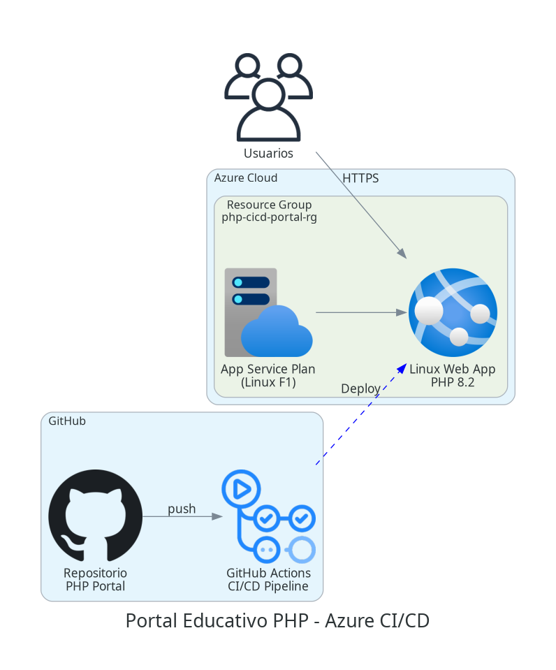
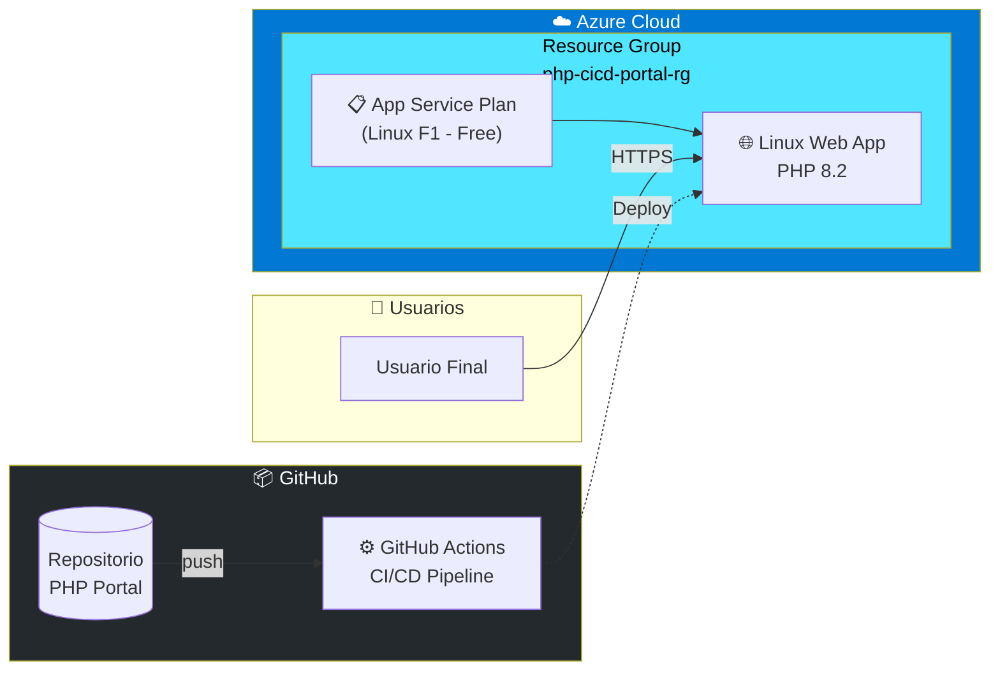

# Architecture Diagram

## Portal Educativo PHP - Azure CI/CD





## Componentes

| Componente | Tipo | Descripción |
|------------|------|-------------|
| **Resource Group** | `azurerm_resource_group` | Contenedor lógico para todos los recursos |
| **App Service Plan** | `azurerm_service_plan` | Plan Linux F1 (Free Tier) |
| **Web App** | `azurerm_linux_web_app` | Aplicación PHP 8.2 con HTTPS |
| **GitHub Actions** | CI/CD | Pipeline de deploy automático |

## Flujo de Deployment

1. **Push** → Desarrollador hace push al repositorio
2. **CI/CD** → GitHub Actions ejecuta tests y build
3. **Deploy** → Código se despliega a Azure Web App
4. **Live** → Usuarios acceden vía HTTPS

## Infraestructura como Código

```
terraform/
├── main.tf          # Recursos principales (RG, Plan, WebApp)
├── variables.tf     # Variables configurables
├── outputs.tf       # Valores de salida
├── providers.tf     # Configuración de Azure provider
└── backend.tf       # Estado remoto en Azure Storage
```
