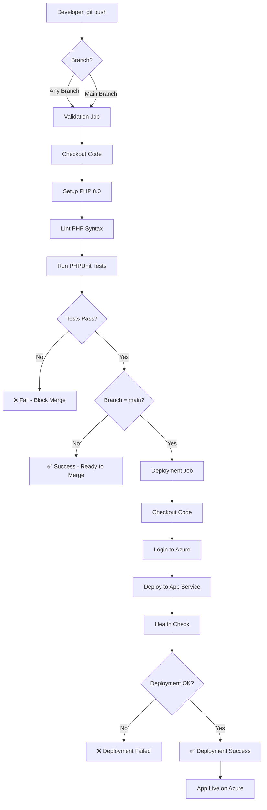
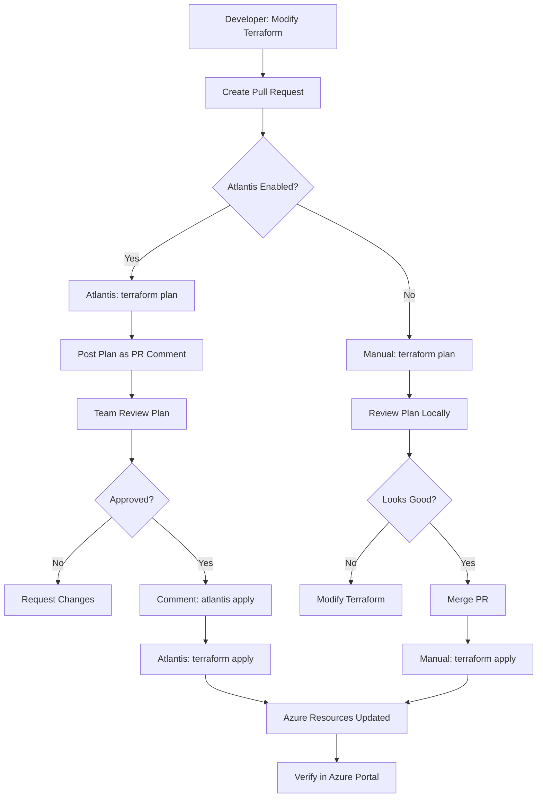

# Architecture Documentation

This document provides a comprehensive overview of the Azure PHP CI/CD Portal architecture, including system components, data flow, and deployment workflows.

## Table of Contents

1. [System Overview](#system-overview)
2. [High-Level Architecture](#high-level-architecture)
3. [Component Details](#component-details)
4. [Data Flow](#data-flow)
5. [CI/CD Pipeline](#cicd-pipeline)
6. [Terraform Workflow](#terraform-workflow)
7. [Security Architecture](#security-architecture)
8. [Deployment Architecture](#deployment-architecture)

---

## System Overview

The Azure PHP CI/CD Portal is a static web application built with PHP that showcases a Post Graduate Course in Cloud Computing. The system is designed with the following principles:

- **Simplicity**: Static content served through PHP templates, no database required
- **Cost-Effectiveness**: Deployed on Azure App Service free tier (F1)
- **Automation**: Full CI/CD pipeline using GitHub Actions
- **Infrastructure as Code**: All Azure resources managed via Terraform
- **Security**: Credentials managed through GitHub Secrets and Azure Service Principals

### Key Technologies

- **Frontend**: HTML5, CSS3, JavaScript
- **Backend**: PHP 8.0+
- **Hosting**: Azure App Service (Linux, F1 tier)
- **CI/CD**: GitHub Actions
- **Infrastructure**: Terraform, Atlantis (optional)
- **Version Control**: Git, GitHub
- **Testing**: PHPUnit

---

## High-Level Architecture

```
┌─────────────────────────────────────────────────────────────────────┐
│                          Developer Workflow                          │
└─────────────────────────────────────────────────────────────────────┘
                                    │
                                    │ git push
                                    ▼
┌─────────────────────────────────────────────────────────────────────┐
│                      GitHub Repository (Public)                      │
│  ┌──────────────┐  ┌──────────────┐  ┌──────────────┐             │
│  │  PHP Source  │  │  Terraform   │  │   GitHub     │             │
│  │    Files     │  │    Config    │  │   Actions    │             │
│  │              │  │              │  │   Workflows  │             │
│  └──────────────┘  └──────────────┘  └──────────────┘             │
└─────────────────────────────────────────────────────────────────────┘
                │                 │                 │
                │                 │                 │
        ┌───────▼────────┐  ┌────▼─────┐  ┌───────▼────────┐
        │  Validation    │  │ Atlantis │  │  Deployment    │
        │  (PHP Lint,    │  │(Terraform│  │  (Azure CLI,   │
        │   PHPUnit)     │  │  PR Auto)│  │   App Deploy)  │
        └───────┬────────┘  └────┬─────┘  └───────┬────────┘
                │                │                 │
                │         ┌──────▼──────┐          │
                │         │   Azure     │          │
                │         │  Resources  │◄─────────┘
                │         │  (Terraform)│
                │         └─────────────┘
                │                │
                └────────────────┼────────────────┐
                                 │                │
                          ┌──────▼──────────┐     │
                          │  Azure App      │     │
                          │  Service (F1)   │◄────┘
                          │  PHP 8.0        │
                          │  Runtime        │
                          └─────────────────┘
                                 │
                                 ▼
                          ┌─────────────┐
                          │  End Users  │
                          │  (Browser)  │
                          └─────────────┘
```

---

## Component Details

### 1. PHP Application Layer

**Purpose**: Serves static content through PHP templates

**Components**:
- **Public Pages** (`public/*.php`): Home, Curriculum, Faculty, Admissions, Contact
- **Shared Components** (`includes/*.php`): Header, Footer, Navigation
- **Configuration** (`includes/config.php`): Site constants and content data
- **Assets** (`public/assets/`): CSS, JavaScript, Images

**Technology Stack**:
- PHP 8.0+
- HTML5 with semantic markup
- CSS3 with responsive design
- Vanilla JavaScript (minimal)

**Responsibilities**:
- Render HTML pages with consistent layout
- Include shared components (header, navigation, footer)
- Serve static assets (CSS, JS, images)
- Provide responsive design for all devices

### 2. Azure Infrastructure Layer

**Purpose**: Hosts the PHP application in the cloud

**Components**:

#### Resource Group
- **Purpose**: Logical container for all Azure resources
- **Configuration**: Name and location (region)
- **Lifecycle**: Created and managed by Terraform

#### App Service Plan
- **Purpose**: Defines compute resources for App Service
- **SKU**: F1 (Free tier)
- **OS**: Linux
- **Specifications**:
  - 1 GB RAM
  - 1 GB storage
  - 60 CPU minutes/day
  - 165 MB bandwidth/day

#### App Service (Web App)
- **Purpose**: Hosts the PHP application
- **Runtime**: PHP 8.0
- **Configuration**:
  - HTTPS only: Enabled
  - Always On: Disabled (not available in F1)
  - Application logging: Enabled
  - Web server logging: Enabled
- **URL**: `https://<app-name>.azurewebsites.net`

### 3. CI/CD Pipeline Layer

**Purpose**: Automates testing and deployment

**Components**:

#### GitHub Actions Workflows
- **Validation Job**:
  - Triggers: Push to any branch, Pull requests
  - Steps: Checkout, Setup PHP, Lint PHP syntax, Run PHPUnit tests
  - Purpose: Ensure code quality before deployment

- **Deployment Job**:
  - Triggers: Push to main branch only
  - Dependencies: Requires validation job success
  - Steps: Checkout, Azure login, Deploy to App Service, Health check
  - Purpose: Deploy validated code to Azure

#### GitHub Secrets
- `AZURE_CREDENTIALS`: Service principal JSON for Azure authentication
- `AZURE_APP_NAME`: Name of the Azure App Service

### 4. Infrastructure as Code Layer

**Purpose**: Manages Azure resources declaratively

**Components**:

#### Terraform Configuration
- **Provider**: Azure RM (azurerm) v3.0+
- **Resources**: Resource Group, App Service Plan, App Service
- **Variables**: Configurable parameters (region, names)
- **Outputs**: App Service URL, resource names
- **State**: Stored locally or in Azure Storage (remote backend)

#### Atlantis (Optional)
- **Purpose**: Automates Terraform workflows via pull requests
- **Workflow**:
  1. PR with Terraform changes triggers `terraform plan`
  2. Plan results posted as PR comment
  3. After approval, `atlantis apply` executes changes
- **Configuration**: `atlantis.yaml` defines project settings

### 5. Version Control Layer

**Purpose**: Manages code versions and collaboration

**Components**:
- **Git**: Distributed version control system
- **GitHub**: Remote repository hosting
- **Branches**: Feature branches, main branch
- **Pull Requests**: Code review and approval process

---

## Data Flow

### User Request Flow

```
┌──────────┐
│  User    │
│ Browser  │
└────┬─────┘
     │ 1. HTTPS Request
     │    (e.g., /curriculum.php)
     ▼
┌─────────────────────┐
│  Azure App Service  │
│  (Load Balancer)    │
└────┬────────────────┘
     │ 2. Route to PHP Runtime
     ▼
┌─────────────────────┐
│  PHP 8.0 Runtime    │
│  (Process Request)  │
└────┬────────────────┘
     │ 3. Execute PHP Script
     ▼
┌─────────────────────┐
│  curriculum.php     │
│  - Include header   │
│  - Include nav      │
│  - Render content   │
│  - Include footer   │
└────┬────────────────┘
     │ 4. Load Configuration
     ▼
┌─────────────────────┐
│  config.php         │
│  - Site constants   │
│  - Course data      │
│  - Faculty info     │
└────┬────────────────┘
     │ 5. Generate HTML
     ▼
┌─────────────────────┐
│  HTML Response      │
│  - Semantic markup  │
│  - CSS links        │
│  - JS scripts       │
└────┬────────────────┘
     │ 6. Return to User
     ▼
┌──────────┐
│  User    │
│ Browser  │
│ (Render) │
└──────────┘
```

### Asset Loading Flow

```
┌──────────┐
│  User    │
│ Browser  │
└────┬─────┘
     │ 1. Parse HTML
     │ 2. Request Assets
     ▼
┌─────────────────────┐
│  Azure App Service  │
└────┬────────────────┘
     │ 3. Serve Static Files
     ▼
┌─────────────────────┐
│  public/assets/     │
│  - css/style.css    │
│  - js/main.js       │
│  - images/*.svg     │
└────┬────────────────┘
     │ 4. Return Assets
     ▼
┌──────────┐
│  User    │
│ Browser  │
│ (Apply   │
│  Styles) │
└──────────┘
```

---

## CI/CD Pipeline

### Complete Pipeline Flow



### Validation Job Details

**Purpose**: Ensure code quality and correctness

**Steps**:
1. **Checkout Code**: Clone repository at specific commit
2. **Setup PHP**: Install PHP 8.0 runtime
3. **Lint PHP Syntax**: Check all `.php` files for syntax errors
   ```bash
   find public includes -name "*.php" -exec php -l {} \;
   ```
4. **Run Tests**: Execute PHPUnit test suite
   ```bash
   vendor/bin/phpunit tests/unit
   ```

**Success Criteria**:
- All PHP files have valid syntax
- All unit tests pass
- No fatal errors or warnings

**On Failure**:
- Workflow marked as failed
- Pull request blocked from merging (if branch protection enabled)
- Developer notified via GitHub

### Deployment Job Details

**Purpose**: Deploy validated code to Azure

**Steps**:
1. **Checkout Code**: Clone repository at specific commit
2. **Login to Azure**: Authenticate using service principal
   ```yaml
   uses: azure/login@v1
   with:
     creds: ${{ secrets.AZURE_CREDENTIALS }}
   ```
3. **Deploy to App Service**: Upload code to Azure
   ```yaml
   uses: azure/webapps-deploy@v2
   with:
     app-name: ${{ secrets.AZURE_APP_NAME }}
     package: .
   ```
4. **Health Check**: Verify app is accessible
   ```bash
   curl -f https://<app-name>.azurewebsites.net
   ```

**Success Criteria**:
- Azure authentication succeeds
- Code uploaded successfully
- App Service restarts without errors
- Health check returns HTTP 200

**On Failure**:
- Workflow marked as failed
- Previous version remains deployed
- Developer notified via GitHub
- Logs available for debugging

---

## Terraform Workflow

### Infrastructure Deployment Flow



### Terraform State Management

**Local State** (Default):
```
terraform/
├── terraform.tfstate       # Current state
├── terraform.tfstate.backup # Previous state
└── .terraform/             # Provider plugins
```

**Remote State** (Recommended for teams):
```hcl
terraform {
  backend "azurerm" {
    resource_group_name  = "terraform-state-rg"
    storage_account_name = "tfstatestorage"
    container_name       = "tfstate"
    key                  = "prod.terraform.tfstate"
  }
}
```

**Benefits of Remote State**:
- Shared state across team members
- State locking prevents concurrent modifications
- Encrypted storage in Azure
- Version history and rollback capability

---

## Security Architecture

### Authentication Flow

```
┌──────────────────┐
│ GitHub Actions   │
│   Workflow       │
└────────┬─────────┘
         │ 1. Read Secret
         ▼
┌──────────────────┐
│ GitHub Secrets   │
│ AZURE_CREDENTIALS│
└────────┬─────────┘
         │ 2. Service Principal JSON
         ▼
┌──────────────────┐
│ Azure AD         │
│ Authentication   │
└────────┬─────────┘
         │ 3. Access Token
         ▼
┌──────────────────┐
│ Azure Resource   │
│   Manager        │
└────────┬─────────┘
         │ 4. Authorized API Calls
         ▼
┌──────────────────┐
│ Azure Resources  │
│ (App Service)    │
└──────────────────┘
```

### Security Layers

1. **Transport Security**:
   - HTTPS enforced on App Service
   - TLS 1.2+ for all connections
   - Free SSL certificate for `*.azurewebsites.net`

2. **Authentication Security**:
   - Service Principal with minimal permissions
   - Credentials stored in GitHub Secrets (encrypted)
   - No credentials in source code
   - Regular credential rotation (90 days)

3. **Access Control**:
   - Service Principal has Contributor role (limited scope)
   - GitHub repository access controlled via permissions
   - Branch protection requires code review
   - Pull request approval before merge

4. **Application Security**:
   - PHP error display disabled in production
   - Input validation on contact form (client-side)
   - No database = no SQL injection risk
   - Static content = minimal attack surface

5. **Infrastructure Security**:
   - Terraform state can be encrypted
   - Azure resources in isolated resource group
   - Network security groups (if configured)
   - Azure DDoS protection (basic, included)

---

## Deployment Architecture

### Multi-Environment Strategy

While this project uses a single environment (production), here's how to extend to multiple environments:

```
┌─────────────────────────────────────────────────────────────┐
│                    GitHub Repository                         │
└─────────────────────────────────────────────────────────────┘
                │                │                │
        ┌───────▼────┐   ┌───────▼────┐   ┌──────▼─────┐
        │    Dev     │   │  Staging   │   │Production  │
        │   Branch   │   │   Branch   │   │   Branch   │
        └───────┬────┘   └───────┬────┘   └──────┬─────┘
                │                │                │
        ┌───────▼────────┐ ┌─────▼────────┐ ┌────▼───────┐
        │ Dev Workflow   │ │Staging       │ │Production  │
        │ (Auto Deploy)  │ │Workflow      │ │Workflow    │
        │                │ │(Auto Deploy) │ │(Manual     │
        │                │ │              │ │ Approval)  │
        └───────┬────────┘ └─────┬────────┘ └────┬───────┘
                │                │                │
        ┌───────▼────────┐ ┌─────▼────────┐ ┌────▼───────┐
        │ Azure Dev      │ │Azure Staging │ │Azure Prod  │
        │ App Service    │ │App Service   │ │App Service │
        │ (F1 Tier)      │ │(B1 Tier)     │ │(P1V2 Tier) │
        └────────────────┘ └──────────────┘ └────────────┘
```

### Scaling Considerations

**Current Architecture** (F1 Tier):
- Single instance
- No auto-scaling
- Limited resources
- Suitable for: Demo, learning, low-traffic sites

**Scaling Options**:

1. **Vertical Scaling** (Upgrade tier):
   - B1 (Basic): More CPU/memory, custom domains
   - S1 (Standard): Auto-scaling, deployment slots
   - P1V2 (Premium): Better performance, VNet integration

2. **Horizontal Scaling** (Multiple instances):
   - Requires Standard tier or higher
   - Load balancing automatic
   - Session state considerations

3. **Caching**:
   - Azure CDN for static assets
   - Redis cache for dynamic content (if added)
   - Browser caching via headers

4. **Database** (If needed in future):
   - Azure Database for MySQL/PostgreSQL
   - Connection pooling
   - Read replicas for scaling reads

---

## Component Responsibilities

### PHP Application
- **Responsibilities**: Render pages, serve content, handle requests
- **Dependencies**: None (self-contained)
- **Interfaces**: HTTP requests/responses
- **Scaling**: Vertical (upgrade App Service tier)

### Azure App Service
- **Responsibilities**: Host PHP runtime, serve HTTP traffic, logging
- **Dependencies**: App Service Plan
- **Interfaces**: HTTPS, Azure Portal, Azure CLI
- **Scaling**: Vertical and horizontal (tier-dependent)

### GitHub Actions
- **Responsibilities**: CI/CD automation, testing, deployment
- **Dependencies**: GitHub repository, Azure credentials
- **Interfaces**: GitHub API, Azure API
- **Scaling**: Parallel jobs (paid plans)

### Terraform
- **Responsibilities**: Infrastructure provisioning, state management
- **Dependencies**: Azure provider, Azure credentials
- **Interfaces**: Azure Resource Manager API
- **Scaling**: Workspaces for multiple environments

---

## Monitoring and Observability

### Available Metrics

**App Service Metrics**:
- CPU Time
- Memory Usage
- Data In/Out
- HTTP Requests
- Response Time
- HTTP Status Codes (2xx, 4xx, 5xx)

**Application Logs**:
- PHP errors and warnings
- Web server logs (access logs)
- Deployment logs

### Monitoring Tools

1. **Azure Portal**:
   - Real-time metrics dashboard
   - Log streaming
   - Diagnostic settings

2. **Azure CLI**:
   ```bash
   # View metrics
   az monitor metrics list --resource <app-id> --metric CpuTime
   
   # Stream logs
   az webapp log tail --name <app-name> --resource-group <rg-name>
   ```

3. **Application Insights** (Optional upgrade):
   - Detailed performance monitoring
   - Request tracking
   - Dependency mapping
   - Custom telemetry

---

## Disaster Recovery

### Backup Strategy

**Code**:
- Stored in GitHub (primary)
- Cloned to developer machines (secondary)
- GitHub has built-in redundancy

**Infrastructure**:
- Defined in Terraform (reproducible)
- Terraform state backed up (if using remote state)
- Can recreate from scratch in minutes

**Data**:
- No database (stateless application)
- Configuration in code (version controlled)
- No user-generated content

### Recovery Procedures

**Scenario 1: App Service Failure**
1. Check Azure service health
2. Restart App Service via Portal or CLI
3. If persistent, redeploy via GitHub Actions
4. If still failing, recreate with Terraform

**Scenario 2: Accidental Deletion**
1. Check Terraform state for resource IDs
2. Run `terraform apply` to recreate resources
3. Redeploy application via GitHub Actions
4. Verify functionality

**Scenario 3: Code Corruption**
1. Identify last known good commit in GitHub
2. Revert to that commit
3. Push to main branch
4. GitHub Actions redeploys automatically

**Recovery Time Objective (RTO)**: < 30 minutes
**Recovery Point Objective (RPO)**: Last commit (minutes)

---

## Future Enhancements

Potential architecture improvements:

1. **Add Database**: Azure Database for MySQL/PostgreSQL for dynamic content
2. **Add CDN**: Azure CDN for faster global content delivery
3. **Add Caching**: Redis cache for improved performance
4. **Add Monitoring**: Application Insights for detailed telemetry
5. **Add Authentication**: Azure AD B2C for user authentication
6. **Add API**: RESTful API for mobile app or integrations
7. **Add Queue**: Azure Queue Storage for async processing
8. **Add Storage**: Azure Blob Storage for user uploads
9. **Multi-Region**: Deploy to multiple regions for high availability
10. **Container**: Migrate to Azure Container Apps for better scaling

---

## Additional Resources

- [Azure App Service Architecture](https://docs.microsoft.com/azure/app-service/overview)
- [GitHub Actions Architecture](https://docs.github.com/actions/learn-github-actions/understanding-github-actions)
- [Terraform Architecture](https://www.terraform.io/docs/language/index.html)
- [Azure Well-Architected Framework](https://docs.microsoft.com/azure/architecture/framework/)
